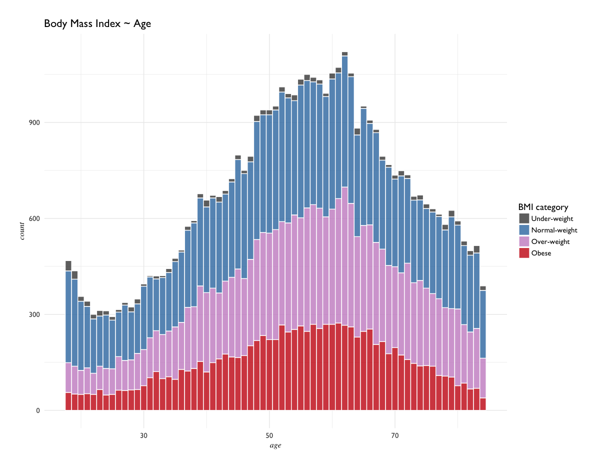
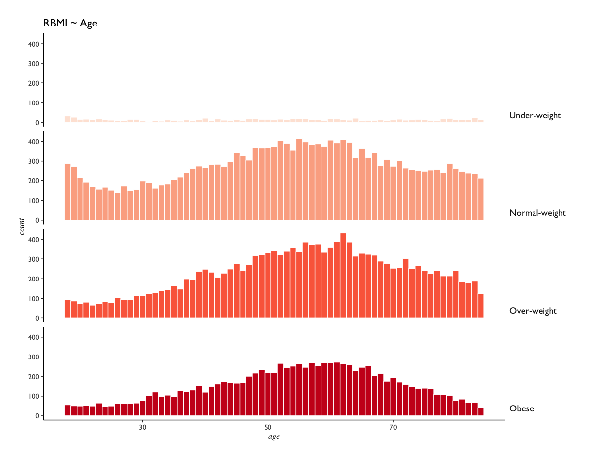
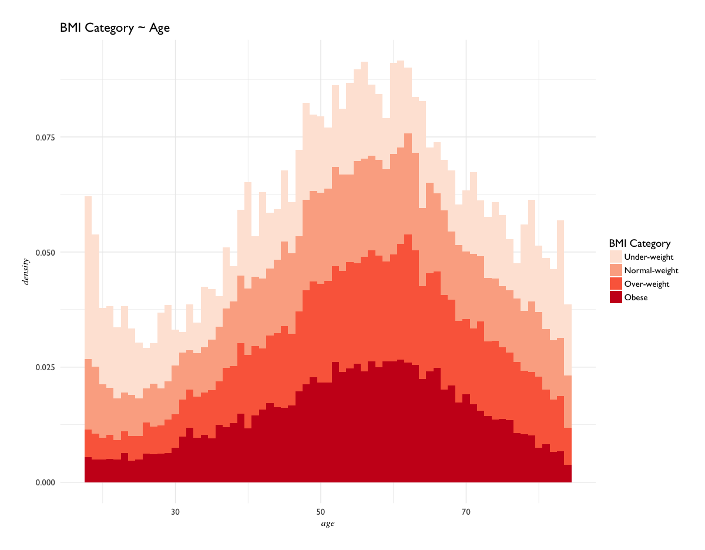
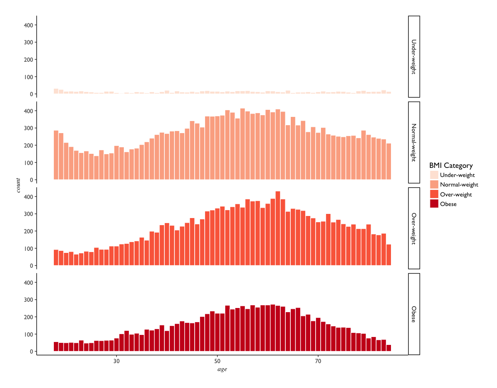
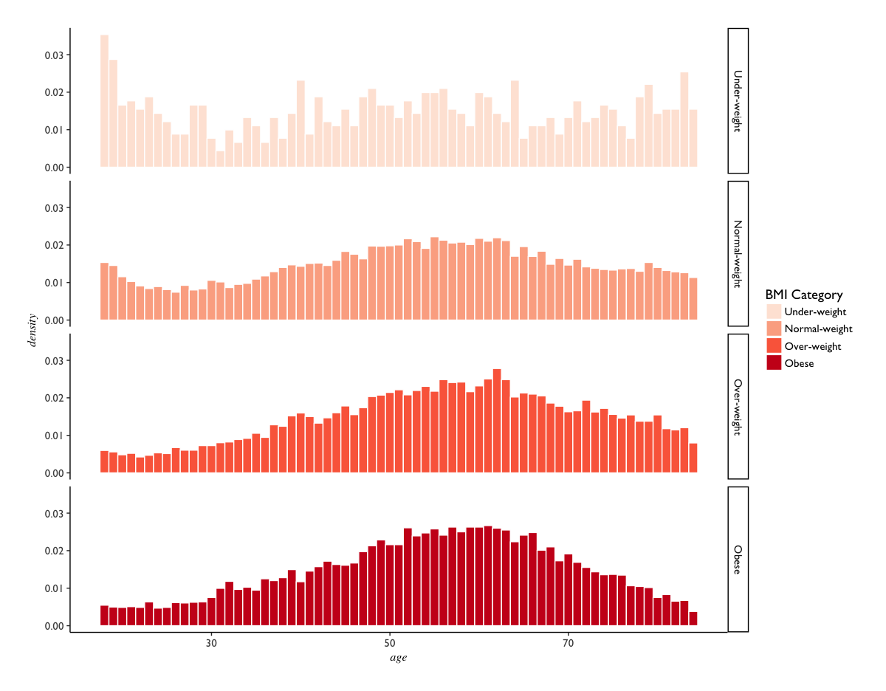
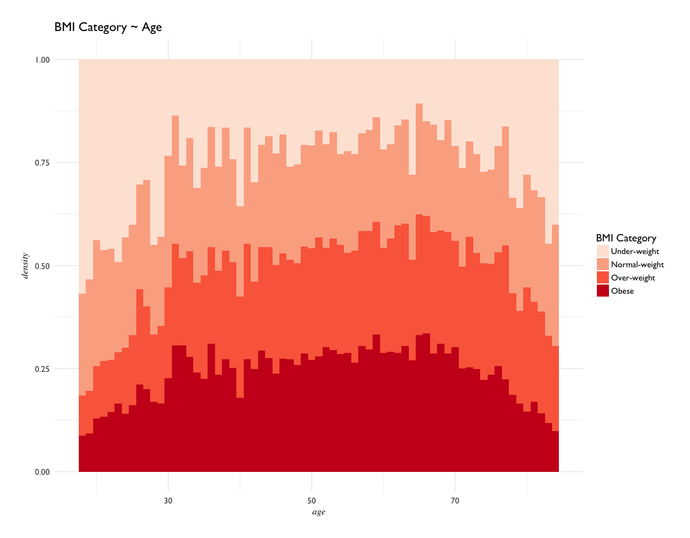
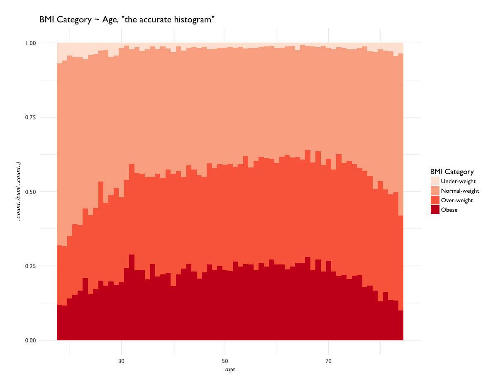
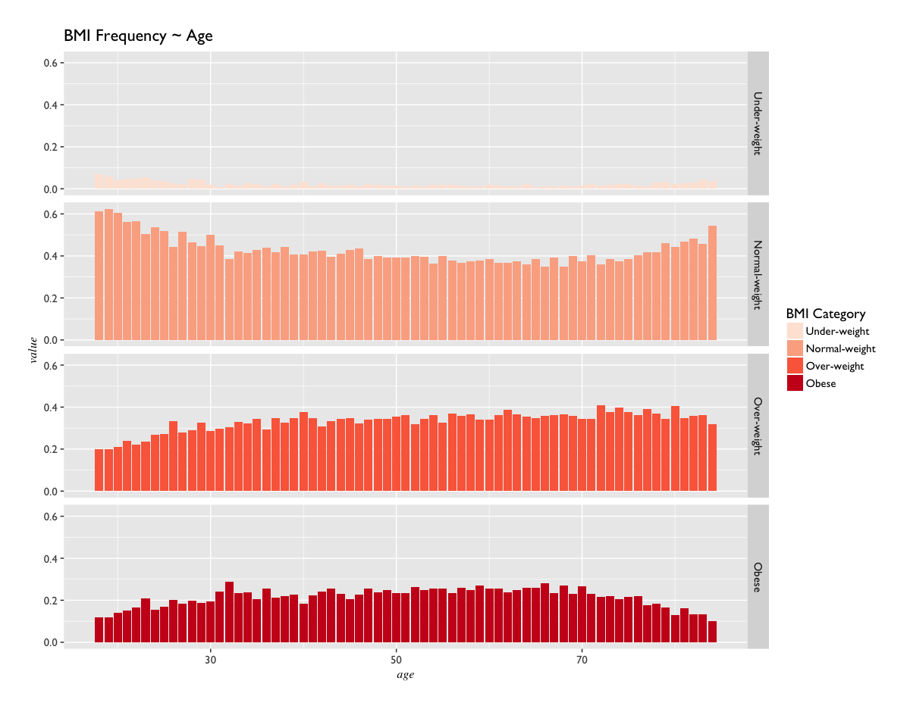
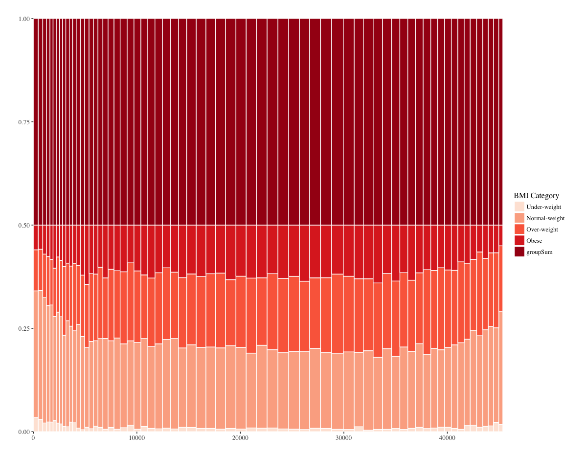
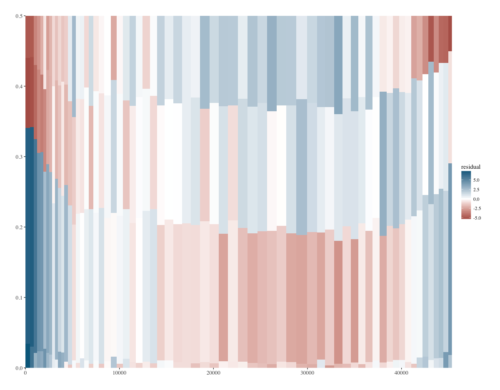

# Exploratory Data Analysis 
---------------------------

_student work in R_ for [Foundations of Data Science](https://www.springboard.com/workshops/data-science)

code:

- [CHIS.R](CHIS.R) - in depth plotting of variables from the California Health Intervew Survey. Includes faceted plots, contingency tables, chi-sqaure testing, and a generalized function for mosaic plots of variables.

data source:

- [CHIS website](http://healthpolicy.ucla.edu/chis/data/Pages/public-use-data.aspx) - requires login


# CHIS

*_What is CHIS?_*

**"The California Health Interview Survey (CHIS) is the largest state health survey in the nation. It is a random-dial telephone survey that asks questions on a wide range of health topics. CHIS is conducted on a continuous basis allowing the survey to generate timely one-year estimates. CHIS provides representative data on all 58 counties in California and provides a detailed picture of the health and health care needs of California’s large and diverse population."**

The above information was taken directly from the [California Health Interview Survey](http://healthpolicy.ucla.edu/chis/about/Pages/about.aspx) website.

```{r}
library(ggplot2)
library(Hmisc)
library(scales)

# load data -------------------------------------------------------------------

adult <- spss.get("data/ADULT.sav")

# Explore the dataset with summary and str
str(adult)
summary(adult)
adult$BM
```

The dataset is a bit of a mess, but the main variables of concern for this exercise revolve around Body Mass Index (BMI) and Age. To save time and prevent myself from over-customizing exploratory plots, I've defined a general ggplot2 theme to use:

```{R}
# Define a general theme:
# assigns GillSans to theme_minimal, makes axis titles italic set in Times.
pd.theme <- theme_minimal(base_size = 14, base_family = "GillSans") +
  theme(plot.margin = unit(c(0.5, 0.5, 0.5, 0.5), "cm"),
        axis.title = element_text(family = "Times", face = "italic", size = 12,
        margin(1, 1, 0, 0)))
```

First we look at how Body Mass Index is distributed over Age.



Initial explorations:




Density:





Density, facetted:





An Accurate Histogram:





Contingency table:



Chi-Sq table:




