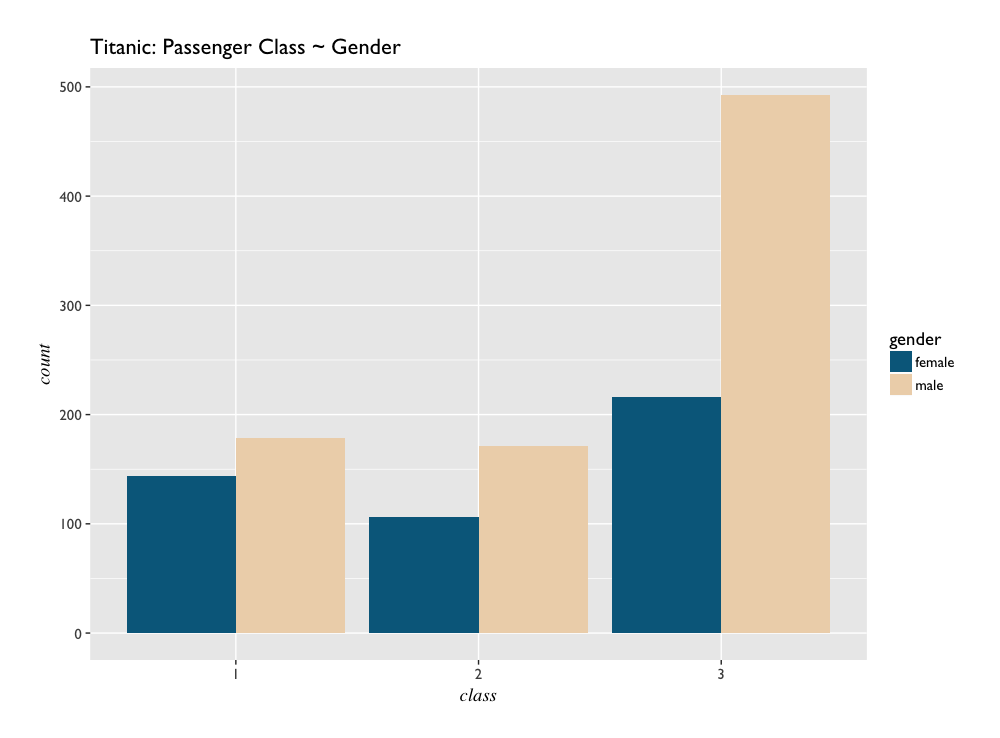
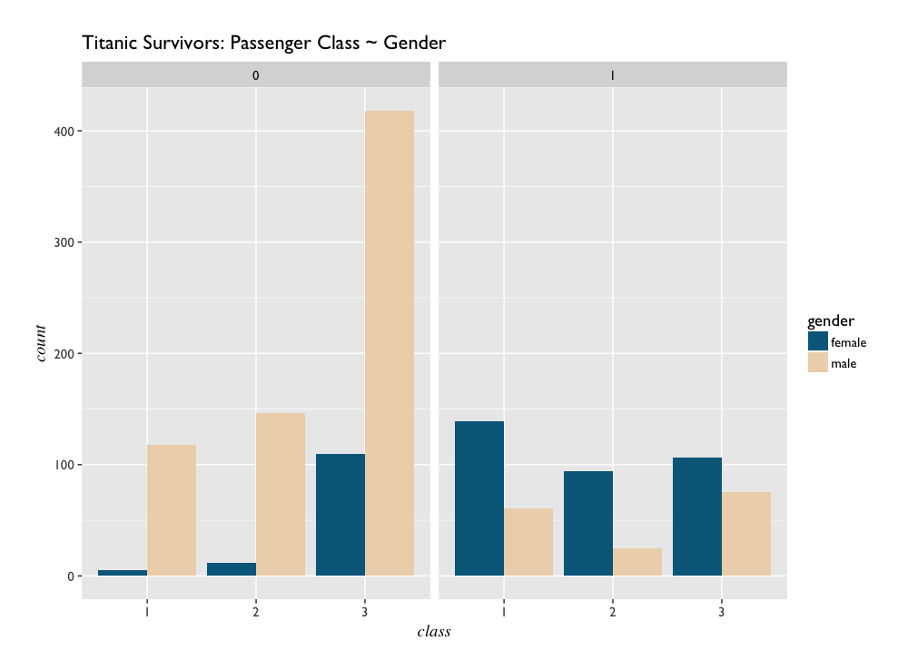
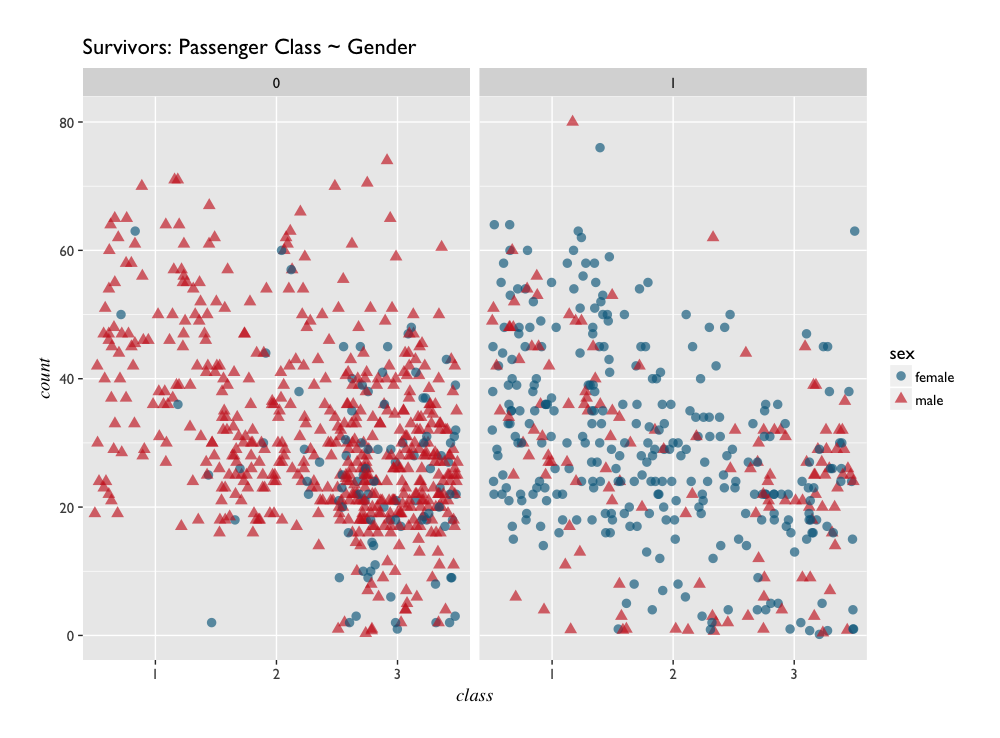

# Exploratory Data Analysis 
---------------------------

_student work in R_ for [Foundations of Data Science](https://www.springboard.com/workshops/data-science)

code:

- [Titanic](titanic.R) - exploratory plots of variables from the Titanic dataset. 
- [CHIS](CHIS.R) - in depth plotting of variables from the California Health Intervew Survey. Includes faceted plots, contingency tables, chi-sqaure testing, and a generalized function for mosaic plots of variables.

data sources:

- [Titanic](biostat.mc.vanderbilt.edu/wiki/pub/Main/DataSets/titanic3.xls) - Harrell class
- [CHIS](http://healthpolicy.ucla.edu/chis/data/Pages/public-use-data.aspx) - requires login

## Titanic

Life tended to end, for men travelling 3rd class.

## CHIS

*_What is CHIS?_*

	The California Health Interview Survey (CHIS) is the largest state health survey in the nation. It is a random-dial telephone survey that asks questions on a wide range of health topics. CHIS is conducted on a continuous basis allowing the survey to generate timely one-year estimates. CHIS provides representative data on all 58 counties in California and provides a detailed picture of the health and health care needs of California’s large and diverse population.

The above information was taken directly from the [California Health Interview Survey](http://healthpolicy.ucla.edu/chis/about/Pages/about.aspx) website.

